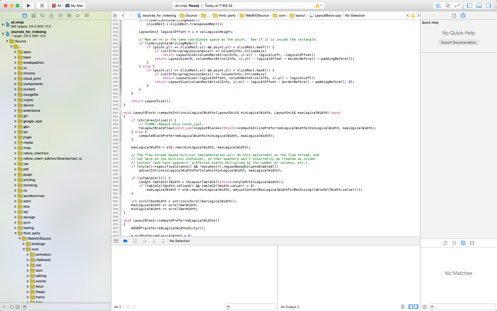
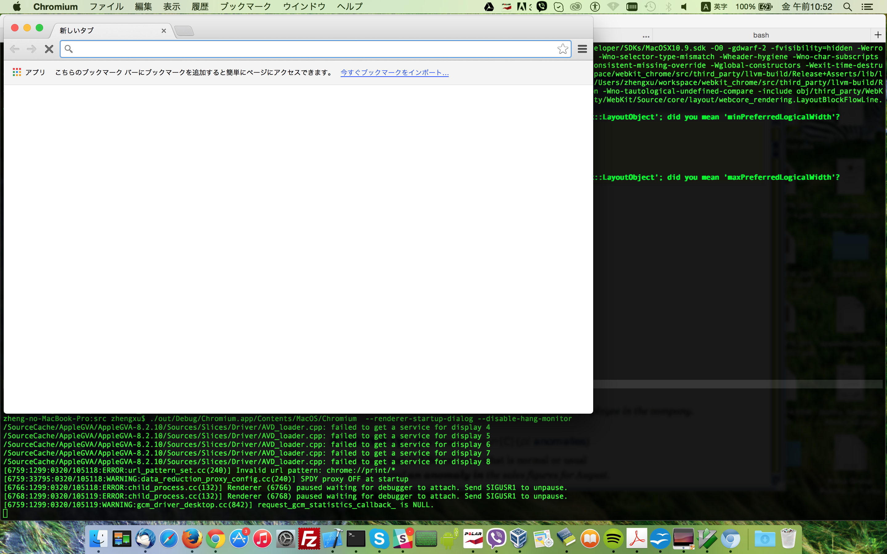
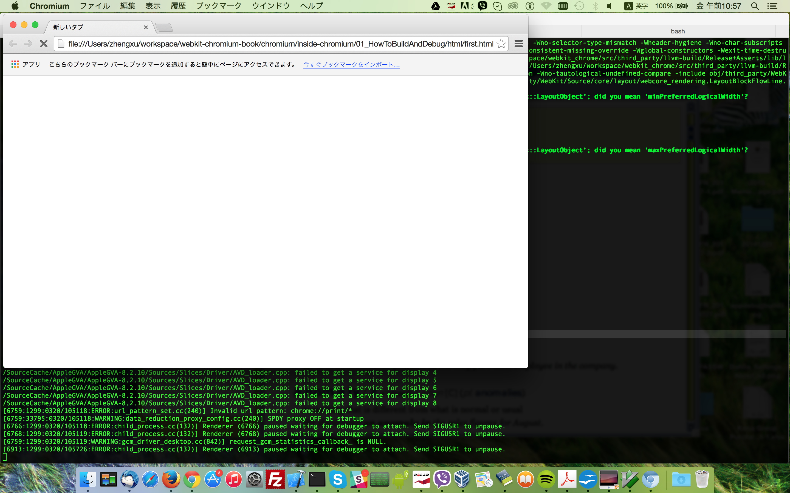
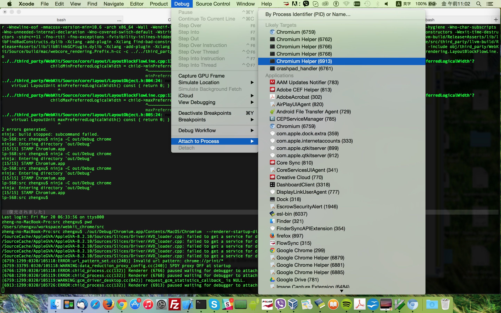
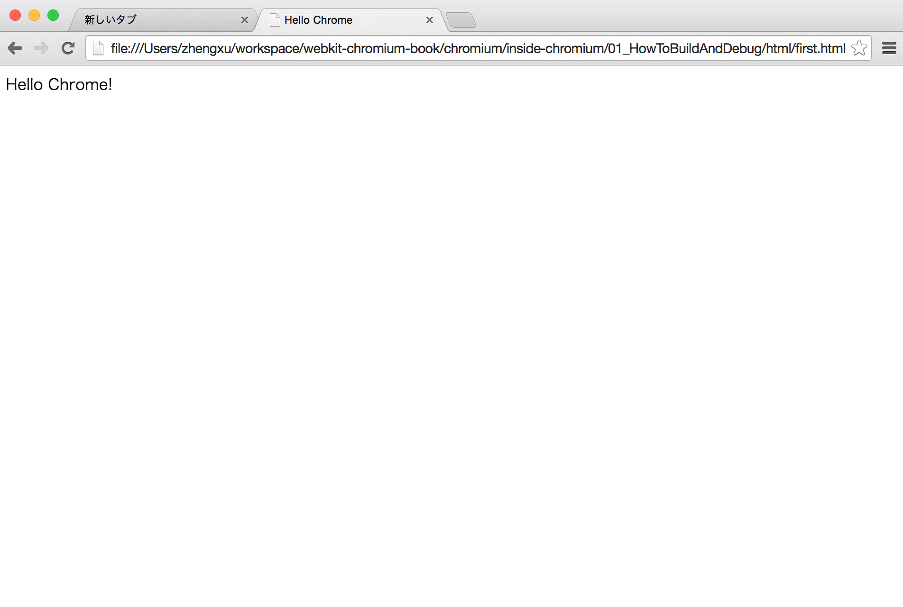
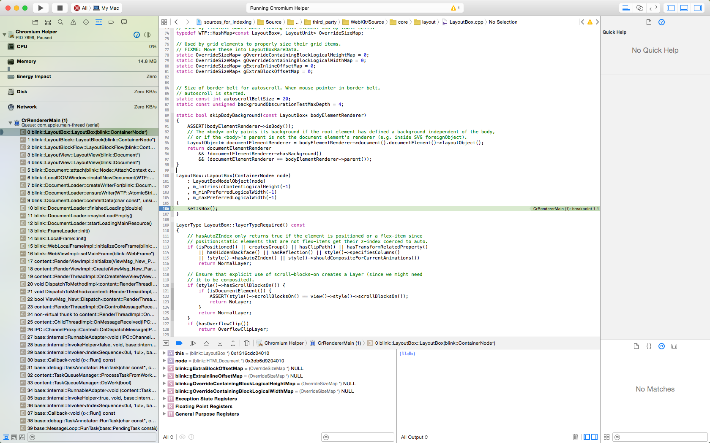

# How to get source code, build, and debug

## get depot_tool and source code for first building

```
$ git clone https://chromium.googlesource.com/chromium/tools/depot_tools.git
$ export PATH=`pwd`/depot_tools:"$PATH"
$ fetch --nohooks blink
$ gclient runhooks
$ ninja -C out/Debug chrome
```

Then, should can run chrome from terminal as following:

```
$ ./out/Debug/Chromium.app/Contents/MacOS/Chromium
```

### Disable crash report on OSX

```
$ launchctl unload -w /System/Library/LaunchAgents/com.apple.ReportCrash.plist
$ sudo launchctl unload -w /System/Library/LaunchDaemons/com.apple.ReportCrash.Root.plist
```

## start waiting for debugger to attach

```
$ ./out/Debug/Chromium.app/Contents/MacOS/Chromium  --renderer-startup-dialog
```

### also disable hang report when debugging which is realy annoying

```
echo "./out/Debug/Chromium.app/Contents/MacOS/Chromium  --renderer-startup-dialog --disable-hang-monitor" > ../start_chrome.sh
```

### Create xcodeproj file for XCode

```
$ GYP_GENERATORS=ninja,xcode-ninja build/gyp_chromium
$ gclient runhooks
```

## Debug on XCode

Now we can find build/all.ninja.xcworkspace in chromium source folder, open it with XCode.
Once XCode finished indexing source file, you will get project window like following:


Now we start to debug.
Assume we have following [first.html](./html/first.html) as following to load for test.

```
<!DOCTYPE HTML>
<html lang="en">
<head>
	<meta charset="UTF-8">
	<title></title>
</head>
<body>
  Hello Chrome!
</body>
</html>
```

First run following from terminal
```
$ ./out/Debug/Chromium.app/Contents/MacOS/Chromium  --renderer-startup-dialog --disable-hang-monitor
```
Then, will get Chrome startup waiting for debugger as following:

Note that we have following two lines in terminal:
```
$ [6766:1299:0320/105118:ERROR:child_process.cc(132)] Renderer (6766) paused waiting for debugger to attach. Send SIGUSR1 to unpause.
$ [6768:1299:0320/105119:ERROR:child_process.cc(132)] Renderer (6768) paused waiting for debugger to attach. Send SIGUSR1 to unpause.
```
The number 6768 and 6766 are the process id (pid) for rendering process which we will always use later. Here we just need to know about it, will show how we use it soon when start to attach debugger.
Now we put path of above html in address bar of chrome and go to that page:


Note that we have a new line shown in terminal now, the pid (6913) is what we need to attach debugger, and just show us a blank page on chrome at this moment.
```
[6913:1299:0320/105726:ERROR:child_process.cc(132)] Renderer (6913) paused waiting for debugger to attach. Send SIGUSR1 to unpause.
```

Now, we go to XCode and try to attach the above pid as following:

Then, if we attached debug successfully, chrome will render html instead of a blank page

That's it, simple and actually did nothing right?
Okay, we can try to add some breakpoint then which we do again and again everyday.

### Add a breakpoint

Since chromium(blink) will always create a LayoutBox, we add a breakpoint at here to test. If you don't know what is LayoutBox, don't worry, I will talk more about it when explaining layout tree in other chapter. Here what we need to know is just, okay, we can add a breakpoint and stop debugger at here.


